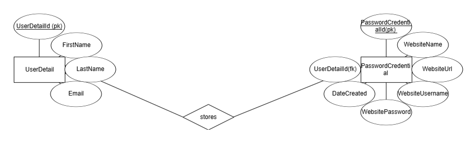

# Encryptify - Secure Password Management System
## OVERVIEW
Encryptify is a password management application designed to securely store and manage user password credentials. It allows users to save their login credentials (username and password) for different websites, which eliminates the stress of remembering multiple passwords. This app uses MVC (Model-View-Controller) architecture to organize the application's structure, and ensure clean and maintainable code.

## WORKFLOW AND INTERACTION BETWEEN MODELS, VIEWS, & CONTROLLERS
### MODELS
#### UserDetail Model (UserDetail.cs)
Stores user credentials for the Encryptify Application login. Allows users to register in to the app to enable them save their password credentials and keep track of their saved password credentials.
##### Components:
* UserDetailId (primary key in UserDetail Model. Used to implement one-to-many relationship)
* First Name (User first name)
* Last Name (User last name)
* Email (User email address)

#### PasswordCredential Model (PasswordCredential.cs)
Stores the actual passwords for various websites. Each password entry is tied to a specific user and a website.
##### Components:
* PasswordCredentialId (primary key for PasswordCredential Model)
* WebsiteName (Name of the website)
* WebsiteUrl (Link to the website)
* WebsiteUsername (Username for a website)
* WebsitePassword (Password for a website)
* DateCreated (Date a user stores password credentials for a website)
* UserDetailId (foreign key in PasswordCredential Model. Used to implement one-to-many relationship)

### CONTROLLERS
#### HomeController.cs
Home page of the SecurePass application.

#### UserDetailsController.cs
Manages user details (personal information).

#### PasswordCredentialsController.cs
Manages the CRUD operations (Create, Read, Update, Delete) for saving and displaying password entries for various websites.

### VIEWS
#### Home Views
Contains information about the application (description, purpose, team student names and numbers, course code and name).
##### Components:
* Index.cshtml (default view for the HomeController)
* Privacy.cshtml (privacy page for the HomeController)

#### UserDetail Views
Includes views for performing user profile operations.
##### Components:
* Index.cshtml (default view for the UserController, provides links to Create, Edit, Details, and Delete actions)
* Create.cshtml (for new user profile)
* Edit.cshtml (to update user profile)
* Details.cshtml (to display user profile)
* Delete.cshtml (to delete user profile)

#### PasswordCredential Views
Allow users to add, view, edit, or delete password credentials.
##### Components:
* Index.cshtml (default view for the PasswordCredentialController, provides links to Create, Edit, Details, and Delete actions)
* Create.cshtml (to save a new password credential)
* Edit.cshtml (to modify stored password credentials)
* Details.cshtml (to view a list of saved passwords)
* Delete.cshtml (to remove a saved password credential)

## ENTITY-RELATIONSHIP DIAGRAM (ONE-TO-MANY RELATIONSHIP BETWEEN USER AND PASSWORD CREDENTIALS)

## DATA FLOW
1. User accesses the website - The user visits the website and navigates to the User Details page in the header.

2. User Registration - The user clicks on the create button to register a profile and provides their details (full name, email). This information is saved to the User model in the database. They can also edit, view, or delete a profile.

3. Password Credential Operations: After registering, the user can access the Password Credentials page and perform operations (view, add, edit, delete) on the credentials. They click on Create to input the name of the website, and the URL(if they wish), with their associated username and password as well as the date of password entry. The password is stored in the database in the PasswordCredential Model, along with the website information. The user can tie the credentials to a particular profile via a dropdown menu in the create page to select their registered email for the profile.

## HOW TO USE THE APP
### 1. Access the App
Go to [Encryptify](https://encryptify-hbewgrgbgnb4g8bd.canadacentral-01.azurewebsites.net) to access the application.

### 2. Managing Your Profile
##### To create a New Profile:
On the homepage, click the User Details page.
Click the Create New button.
Fill in your details:
* First Name
* Last Name
* Email Address
Click Create to complete the profile. Your details will be securely stored in the database.

##### To Edit Your Profile:
Navigate to the User Details page to update your personal details.
Click on Edit.
Click Save to apply the changes.

##### To View Your Profile Details:
Click the Details button next to your stored profile information.
Your full profile details will be displayed.

##### To Delete a Profile:
If you wish to permanently remove your profile, navigate to the User Details page and select the Delete option.
This will erase all your personal information from the system.

### 3. Managing Your Password Credentials
On the homepage, go to the Password Credentials page
##### To create a New Password Credential:
Click the Create New button.
Fill in the following details:
* Website Name (e.g., "Facebook")
* Website URL (optional, but recommended)
* Website Username (your login username for the website)
* Website Password (the password for the website)
* Date Created (the current date).
* Select the email connected to the profile you wish to use from the dropdown menu.
* Click Create to securely store the credentials.

##### To Edit or Update a Password:
Click the Edit button next to a saved password entry.
Modify the necessary details (e.g., website name, username, or password).
Click Save to update the password credentials.

##### To View a Saved Password:
Click the Details button next to a stored password entry.
The full details of the password credentials will be displayed.

##### To Delete a Password:
Click the Delete button next to the password entry.
Confirm the deletion in the popup to permanently remove the password from your account.
